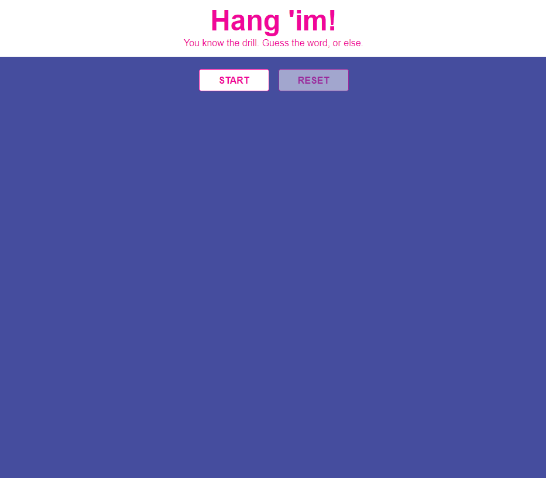

# Hangman - Bootcamp study project

This project is finished for 75%.
Will finish for 100% it one day )))

## 🦊 Pre-lecture

⏲️ _Estimated time required: 45 minutes._

- https://reactjs.org/docs/hooks-state.html
- https://www.youtube.com/watch?v=uh4b0QtTlgM

---

## Setup

### Install the dependencies

```
yarn install
```

### Spin up the dev environment

```
yarn start
```

### Install styled-components npm or yarn
```
npm install --save styled-components
yarn add styled-components
```

---


Today you are going to build a hangman game!

It **not** writing from scratch. Some of the code has been already provided.
All of the components are there. Most of the styling is done, but it needs to wire everything together with state.
The workshop exercises are also provided to finish everything for 100%.



